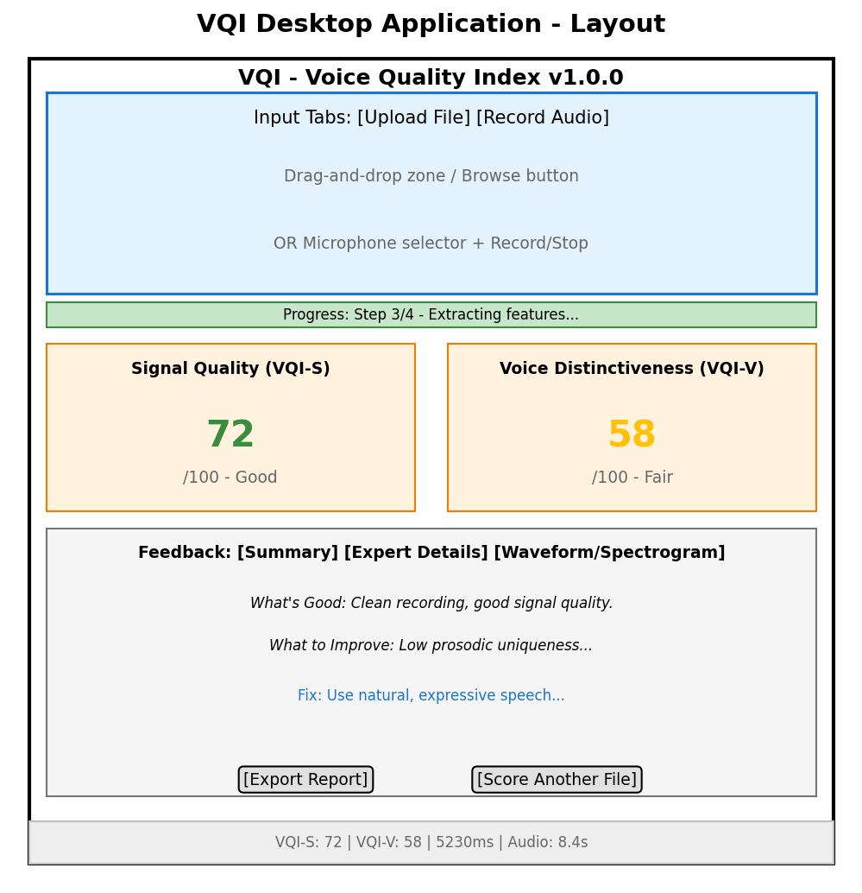

# VQI: Voice Quality Index for Speaker Recognition

A biometric sample quality metric that predicts whether a speech recording will produce reliable speaker verification results. VQI follows the NIST NFIQ 2 methodology (NIST.IR.8382) adapted for the speech domain.

## Overview

VQI produces two complementary scores from 0 to 100:

- **VQI-S (Signal Quality):** Measures recording quality -- noise, reverberation, spectral distortion, dynamics, and channel artifacts. 430 features extracted from the audio signal.
- **VQI-V (Voice Distinctiveness):** Measures how well-suited a voice sample is for speaker recognition -- cepstral stability, formant clarity, and prosodic consistency. 133 features.

Higher scores indicate better quality for speaker recognition systems.

**Key Results (v4.0):**
- Trained on 1.2 million speech samples from 8 datasets
- Evaluated against 5 speaker recognition systems (ECAPA-TDNN, ResNetSE34, ECAPA2, x-vector, WavLM)
- VQI-S: Ridge Regressor, AUC = 0.8812, mean ERC@20% = 7.7%
- VQI-V: XGBoost Regressor, AUC = 0.9122, mean ERC@20% = 6.1%
- DR optimization: 8 methods tested, full features (no DR) confirmed optimal
- Model size: 6.7MB total (100x smaller than v2.0)
- 5 test datasets, 5 providers, cross-system generalization confirmed

## Desktop Application

A standalone Windows desktop application is available with a graphical interface, animated score gauges, and plain-language feedback.

### Download

**[Download VQI v4.0 from Google Drive](https://drive.google.com/drive/folders/1C9p9ENf_eA-GmDh--iXlX6bwLdupAkh6)**

1. Download **`VQI-v4.0-windows.zip`** from the link above
2. Extract the ZIP to any folder on your computer
3. Open the extracted folder and run **`VQI.exe`**

v4.0 uses Ridge (VQI-S) + XGBoost (VQI-V) regressors on full features with per-score StandardScaler.

No installation or Python required.

### System Requirements

- Windows 10 or Windows 11 (64-bit)
- 8 GB RAM minimum (16 GB recommended)
- ~5 GB free disk space
- Audio input device (for microphone recording feature)

### Screenshot



### Features

- **File Upload:** Drag-and-drop or browse for audio files (WAV, FLAC, MP3, M4A, OGG)
- **Microphone Recording:** Record directly with device selection and live VU meter
- **Dual Quality Scores:** Animated color-coded 0-100 gauge displays for VQI-S and VQI-V
- **Plain-Language Feedback:** Actionable suggestions to improve recording quality
- **Expert Diagnostics:** Per-feature percentile analysis for technical users
- **Visualization:** Waveform, spectrogram, and mel spectrogram display
- **Export Reports:** Save detailed quality reports as text files

### Troubleshooting

- **VQI.exe does not start:** Ensure the entire folder is extracted, including the `_internal` subfolder. Do not move VQI.exe out of its folder.
- **Slow first scoring:** The application loads machine learning models at startup (~1-2 seconds). Subsequent scores are faster.
- **No audio devices found:** Check that your microphone is connected and Windows recognizes it.
- **Unsupported format:** Convert your audio to WAV or FLAC for best compatibility.

## Python Library

### Quick Start: Score a Single File

```python
from vqi.engine import VQIEngine

# Initialize engine (loads all models once)
engine = VQIEngine(base_dir=".")

# Score a file
result = engine.score_file("path/to/audio.wav")
print(f"VQI-S: {result.score_s}, VQI-V: {result.score_v}")
print(result.plain_feedback_s)
print(result.plain_feedback_v)
```

#### Low-Level Pipeline

```python
from vqi.preprocessing.audio_loader import load_audio
from vqi.preprocessing.normalize import dc_remove_and_normalize
from vqi.preprocessing.vad import energy_vad, reconstruct_from_mask
from vqi.core.feature_orchestrator import compute_all_features
from vqi.core.feature_orchestrator_v import compute_all_features_v
import joblib
import numpy as np
import xgboost as xgb

# Load and preprocess
waveform = load_audio("path/to/audio.wav")
normalized = dc_remove_and_normalize(waveform)
mask, speech_dur, speech_ratio = energy_vad(normalized, 16000)
speech = reconstruct_from_mask(normalized, mask)

# Extract features
features_s, feat_array_s, intermediates = compute_all_features(speech, 16000, mask, raw_waveform=waveform)
features_v, feat_array_v = compute_all_features_v(speech, 16000, mask, intermediates=intermediates)

# Load v4.0 models and predict
scaler_s = joblib.load("models/vqi_v4_scaler_s.joblib")
model_s = joblib.load("models/vqi_v4_model_s.joblib")
# selected_features_s = ... (load from data/step5/evaluation/selected_features.txt)
# feat_vec = np.array([features_s[f] for f in selected_features_s])
# score_s = int(np.clip(np.round(model_s.predict(scaler_s.transform(feat_vec.reshape(1,-1)))[0] * 100), 0, 100))
```

### Installation

```bash
# Clone this repository
git clone https://github.com/YOUR_USERNAME/VQI.git
cd VQI

# Install dependencies
pip install -r requirements.txt
```

### Requirements

- Python 3.10+
- PyTorch 2.0+ (with CUDA recommended for embedding extraction)
- XGBoost 2.0+
- ~16GB RAM for feature extraction
- ~50GB disk for datasets (not included)

## Datasets Required

VQI is trained and evaluated on 8 publicly available speech datasets plus 2 additional test sets. You must obtain these independently (see [DATASETS.md](DATASETS.md) for download links and expected directory structure):

| Dataset | Speakers | Utterances | Used For |
|---------|----------|------------|----------|
| VoxCeleb1 | 1,251 | 153,516 | Training + Testing |
| VoxCeleb2 | 6,112 | 1,128,246 | Training |
| LibriSpeech | 2,484 | 292,367 | Training + Testing |
| VCTK | 110 | 44,455 | Testing |
| VOiCES | 300 | 22,000+ | Training |
| CN-Celeb1 | 1,000 | 126,532 | Testing |
| VPQAD | 54 | 332 | Testing |
| VSEA DC | 100 | 336 | Testing |
| MUSAN | -- | -- | Noise augmentation (training labels) |
| RIR | -- | -- | Reverberation augmentation (training labels) |

## Reproducing the Full Pipeline

The VQI pipeline consists of 8 steps. Each step has dedicated scripts and produces reports in `reports/stepN/`.

### Step 1: Data Collection and Embedding Extraction
Assemble datasets, extract speaker embeddings using 5 providers (P1-P5), compute comparison scores.
```bash
python scripts/inventory_datasets.py
python scripts/create_splits.py
python scripts/extract_embeddings_batched.py
python scripts/compute_scores.py
```

### Step 2: Label Computation
Compute speech durations, set quality thresholds, generate binary labels (Class 0/1), create balanced training set.
```bash
python scripts/run_step2.py
```

### Step 3: Preprocessing Pipeline
Audio loading, DC removal, peak normalization, VAD, quality checks.
```bash
pytest tests/test_preprocessing.py
```

### Step 4: Feature Extraction
Extract 544 VQI-S candidate features and 161 VQI-V candidate features from all training and validation samples.
```bash
python scripts/extract_features.py
```

### Step 5: Feature Evaluation and Selection
Evaluate features using Spearman correlation, ERC contribution, and Random Forest importance. Select top features.
```bash
python scripts/run_step5.py
```
Result: 430 VQI-S features selected, 133 VQI-V features selected.

### Step 6: Model Training
Train Random Forest baseline classifiers, then Ridge + XGBoost regressors.
```bash
python scripts/run_step6.py                    # RF baseline
python scripts/dr_optimization.py              # DR optimization + Ridge/XGBoost training
```
Result: Ridge Regressor (S, AUC=0.8812), XGBoost Regressor (V, AUC=0.9122).

### Step 6b: Dimensionality Reduction Experiments
Train PCA, ICA, and Factor Analysis variants. Compare 8 DR methods.
```bash
python scripts/pca_dimensionality.py
python scripts/train_pca_models.py
python scripts/train_ica_models.py
python scripts/train_fa_models.py
python scripts/dr_optimization.py              # Comprehensive 8-way DR comparison
```
Result: Full features (no DR) confirmed optimal for both VQI-S and VQI-V.

### Step 7: Model Validation
Validate on 50,000 held-out samples. Compute AUC, CDF shift tests, cross-validation.
```bash
python scripts/run_step7.py
```
Result: VQI-S AUC = 0.8812, VQI-V AUC = 0.9122.

### Step 8: Evaluation of Predictive Power
Evaluate on 5 test datasets using ERC, Ranked DET, cross-system analysis.
```bash
python scripts/run_step8.py
python scripts/regenerate_final_model_reports.py    # Full v4.0 report generation
```

### Step X1: Model Enhancement
Comprehensive 56-model comparison (7 families x 2 paradigms x 2 data sizes x 2 score types).
```bash
python scripts/x1_comprehensive_comparison.py
```
Result: Ridge (S) + XGBoost (V) selected as optimal models.

## Pre-trained Models (v4.0)

- `models/vqi_v4_meta.json` -- Metadata (DR config, AUC, ERC metrics)
- `models/vqi_v4_scaler_s.joblib` -- VQI-S StandardScaler (11KB)
- `models/vqi_v4_model_s.joblib` -- VQI-S Ridge Regressor (2.7KB)
- `models/vqi_v4_scaler_v.joblib` -- VQI-V StandardScaler (3.7KB)
- `models/vqi_v4_model_v.json` -- VQI-V XGBoost Regressor (3.3MB)

Total model size: ~3.3MB (vs 705MB in v2.0).

## Repository Structure

```
VQI/
|-- vqi/                    # Core Python package
|   |-- engine.py           # VQIEngine: single entry-point for scoring
|   |-- feedback.py         # Feedback templates, limiting factors, category scores
|   |-- preprocessing/      # Audio loading, normalization, VAD
|   |-- core/               # Feature orchestration, quality algorithm
|   |-- features/           # 23 frame-level + 32 global feature modules (VQI-S)
|   |-- features_v/         # 5 voice distinctiveness feature modules (VQI-V)
|   |-- prediction/         # Legacy RF model loading (v1.0/v2.0)
|   |-- evaluation/         # ERC, DET, cross-system evaluation
|   |-- training/           # Feature selection, model training, validation
|   |-- providers/          # Speaker verification system wrappers (P1-P5)
|-- scripts/                # Step execution and visualization scripts
|-- tests/                  # Unit and integration tests
|-- models/                 # Pre-trained v4.0 models (Ridge + XGBoost)
|-- data/                   # Split manifests, labels, selected features
|   |-- splits/             # Train/val/test split manifests
|   |-- snorm_cohort/       # S-norm cohort embeddings (5 providers)
|   |-- step2/labels/       # Label thresholds
|   |-- step5/evaluation/   # Selected features (430 S, 133 V)
|   |-- step6/full_feature/ # Feature importances
|   |-- step9/              # Percentile tables, feature categories
|-- reports/                # Visualizations and analysis for each step
|   |-- step1/ - step8/     # Per-step analysis reports
|   |-- step9_v2/           # Software v2.0 conformance results
|   |-- Final Model/        # v4.0 comprehensive reports (427 files)
|   |-- x1/                 # 56-model comparison (140 plots)
|   |-- dimensionality_reduction/  # 8-way DR comparison
|-- screenshots/            # Desktop application screenshots
|-- CHANGELOG.md            # Version history (v1.0 - v4.0)
|-- DATASETS.md             # Dataset download links and directory structure
|-- requirements.txt        # Python dependencies
```

## Results Summary (v4.0)

### Model Comparison

| Metric | VQI-S (Ridge) | VQI-V (XGBoost) |
|--------|--------------|-----------------|
| AUC-ROC | 0.8812 | 0.9122 |
| Mean ERC@20% | 7.7% | 6.1% |
| Features | 430 (full) | 133 (full) |
| Training data | 20,288 balanced | 58,102 expanded |
| Inference | 0.005ms | 0.035ms |
| Model size | 2.7KB | 3.3MB |

### DR Optimization (8 Methods Tested)

| Method | VQI-S AUC | VQI-V AUC | Result |
|--------|-----------|-----------|--------|
| **Full (deployed)** | **0.8812** | **0.9122** | **Best** |
| PCA-99% | 0.8763 | 0.8888 | -0.3% |
| FA-BIC | 0.8776 | 0.8954 | -1.0% |
| PCA-95% | 0.8628 | 0.8851 | -2.3% |
| PCA-90% | 0.8587 | 0.8763 | -2.9% |
| PCA-85% | 0.8489 | 0.8694 | -3.8% |
| ICA-PA | 0.8436 | 0.8647 | -4.3% |
| PCA-80% | 0.8438 | 0.8616 | -4.4% |

### Evaluation on 5 Test Datasets (v4.0, 5 Providers)

Full evaluation with ERC, Ranked DET, cross-system generalization, combined ERC, and quadrant analysis across VoxCeleb1-test, VCTK, CN-Celeb, VPQAD, and VSEA DC. See `reports/Final Model/step8/` for all 132 report files.

## Citation

```bibtex
@article{vqi2026,
  title={VQI: Voice Quality Index for Speaker Recognition},
  author={Ajan Ahmed and Masudul H. Imtiaz},
  year={2026}
}
```

## License

MIT License. See [LICENSE](LICENSE) for details.
