# X1 Model Comparison Report

Comprehensive evaluation of 7 classifiers (RF baseline + 6 alternatives)
for both VQI-S and VQI-V on held-out validation and test sets.

## VQI-S

### 1. Summary Table (ranked by AUC-ROC)

| Rank | Model | AUC-ROC | AUC-PR | F1 | Accuracy | Brier | ms/sample |
|------|-------|---------|--------|-----|----------|-------|-----------|
| 1 | **SVM** | **0.9371** | 0.9727 | 0.8979 | 0.8623 | 0.1015 | 2.767 |
| 2 | MLP | 0.9290 | 0.9690 | 0.8705 | 0.8292 | 0.1326 | 0.024 |
| 3 | LightGBM | 0.9236 | 0.9664 | 0.8769 | 0.8358 | 0.1264 | 0.107 |
| 4 | XGBoost | 0.9173 | 0.9606 | 0.8722 | 0.8292 | 0.1311 | 0.039 |
| 5 | TabNet | 0.8965 | 0.9508 | 0.8656 | 0.8196 | 0.1378 | 0.752 |
| 6 | LogReg | 0.8818 | 0.9415 | 0.8445 | 0.7975 | 0.1451 | 0.005 |
| 7 | RF | 0.8721 | 0.9384 | 0.8216 | 0.7710 | 0.1630 | 7.121 |

RF baseline AUC-ROC: 0.8721

| Model | AUC-ROC | Improvement over RF |
|-------|---------|-------------------|
| SVM | 0.9371 | +6.5 pp **MEETS 2pp threshold** |
| MLP | 0.9290 | +5.7 pp **MEETS 2pp threshold** |
| LightGBM | 0.9236 | +5.1 pp **MEETS 2pp threshold** |
| XGBoost | 0.9173 | +4.5 pp **MEETS 2pp threshold** |
| TabNet | 0.8965 | +2.4 pp **MEETS 2pp threshold** |
| LogReg | 0.8818 | +1.0 pp |
| RF | 0.8721 | +0.0 pp |

### 2. ROC Curve Overlay
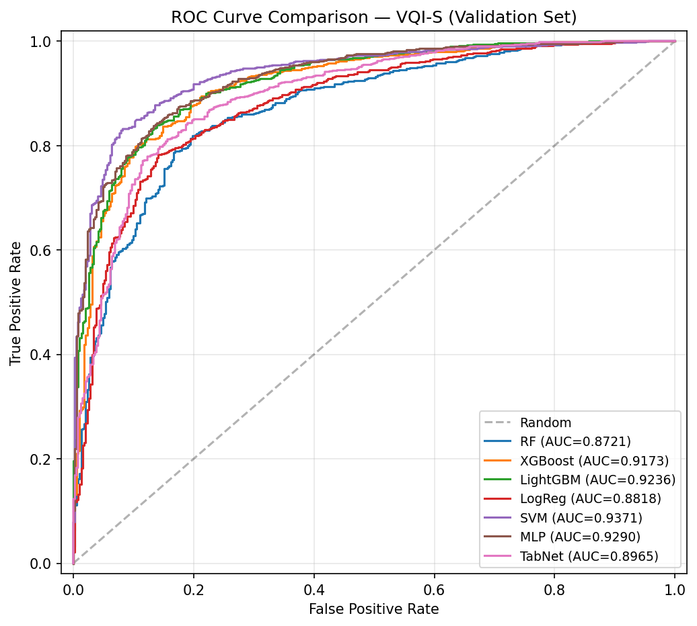

### 3. Score Distributions
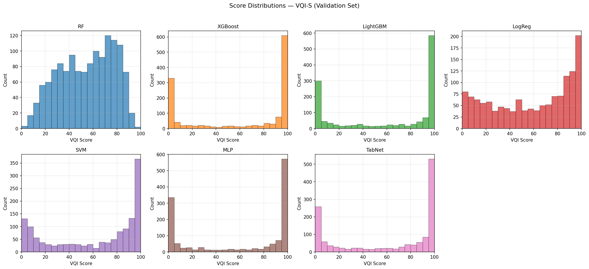

### 4. Metrics Comparison
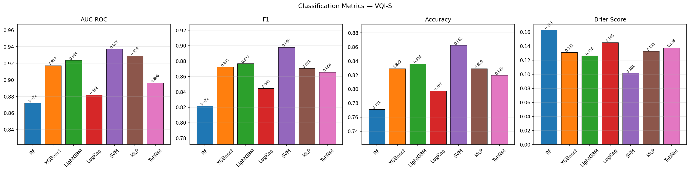

### 5. Calibration
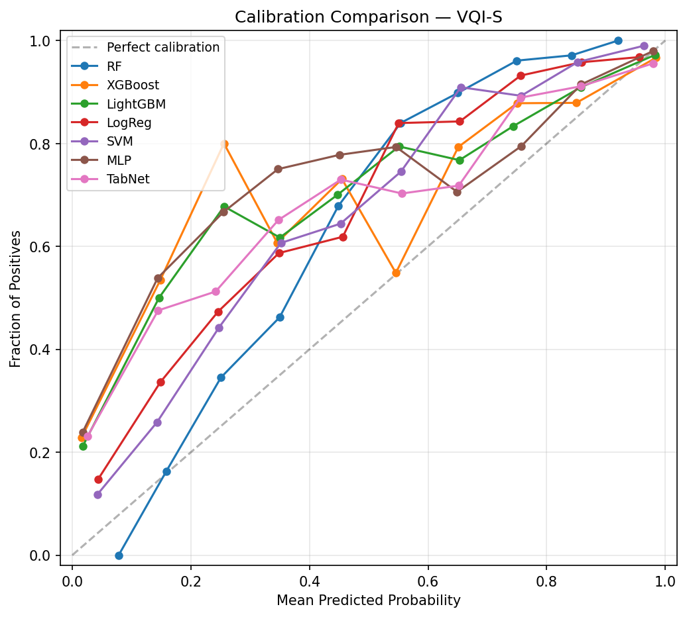

### 6. Confusion Matrices

### 7. Inference Speed
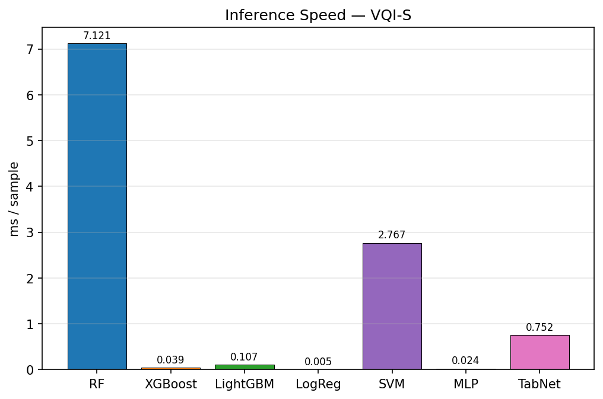

### 8. Feature Importance
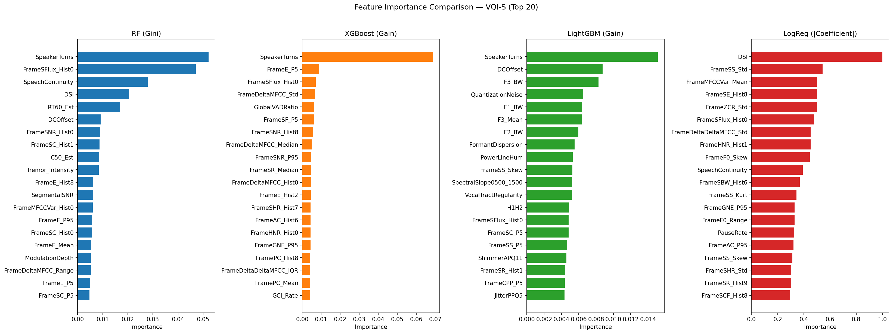

### 9. ERC Curves (sample — VoxCeleb1, P1)
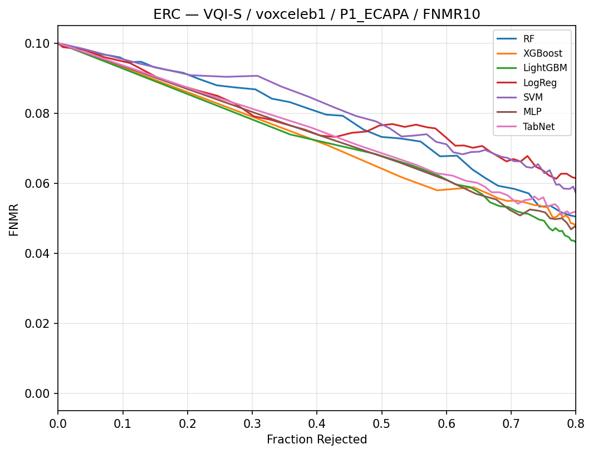

### 10. ERC FNMR Reduction Summary (P1, FNMR@10%, 30% rejection)

| Model | voxceleb1 | vctk | cnceleb | vpqad | vseadc |
|-------|------|------|------|------|------|
| RF | 13.2% | 25.8% | 10.3% | 10.5% | 17.4% |
| XGBoost | 29.1% | 15.4% | 0.0% | 8.8% | 19.8% |
| LightGBM | 26.1% | 0.0% | 0.0% | 20.2% | 14.4% |
| LogReg | 20.9% | 36.8% | 24.4% | 11.4% | 17.1% |
| SVM | 9.3% | -1.3% | -1.5% | 4.1% | 1.3% |
| MLP | 23.2% | 0.0% | 0.0% | 1.0% | 19.4% |
| TabNet | 14.3% | 11.5% | 15.7% | 4.2% | 18.6% |

## VQI-V

### 1. Summary Table (ranked by AUC-ROC)

| Rank | Model | AUC-ROC | AUC-PR | F1 | Accuracy | Brier | ms/sample |
|------|-------|---------|--------|-----|----------|-------|-----------|
| 1 | **SVM** | **0.9434** | 0.9760 | 0.9092 | 0.8756 | 0.0940 | 1.136 |
| 2 | MLP | 0.9355 | 0.9716 | 0.9022 | 0.8667 | 0.1062 | 0.024 |
| 3 | XGBoost | 0.9349 | 0.9707 | 0.8947 | 0.8571 | 0.1085 | 0.036 |
| 4 | LightGBM | 0.9290 | 0.9668 | 0.8945 | 0.8564 | 0.1139 | 0.078 |
| 5 | TabNet | 0.9153 | 0.9606 | 0.8869 | 0.8446 | 0.1234 | 1.509 |
| 6 | RF | 0.8814 | 0.9419 | 0.8177 | 0.7666 | 0.1603 | 7.029 |
| 7 | LogReg | 0.8798 | 0.9394 | 0.8315 | 0.7798 | 0.1477 | 0.005 |

RF baseline AUC-ROC: 0.8814

| Model | AUC-ROC | Improvement over RF |
|-------|---------|-------------------|
| SVM | 0.9434 | +6.2 pp **MEETS 2pp threshold** |
| MLP | 0.9355 | +5.4 pp **MEETS 2pp threshold** |
| XGBoost | 0.9349 | +5.4 pp **MEETS 2pp threshold** |
| LightGBM | 0.9290 | +4.8 pp **MEETS 2pp threshold** |
| TabNet | 0.9153 | +3.4 pp **MEETS 2pp threshold** |
| RF | 0.8814 | +0.0 pp |
| LogReg | 0.8798 | -0.2 pp |

### 2. ROC Curve Overlay
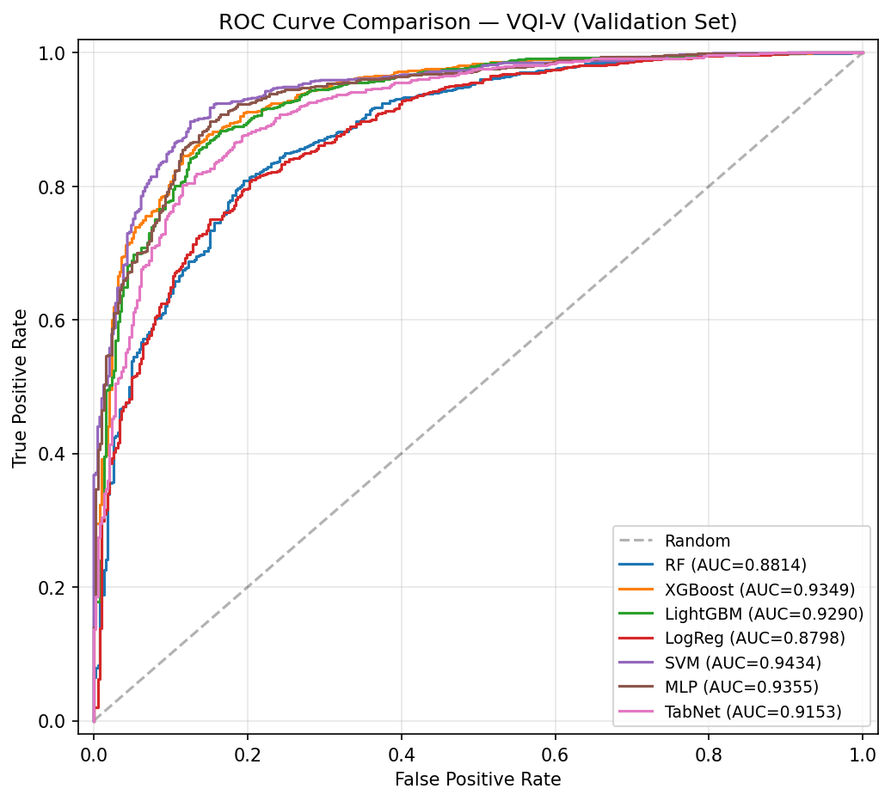

### 3. Score Distributions
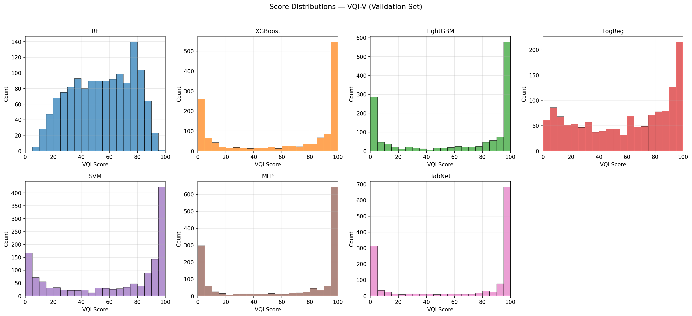

### 4. Metrics Comparison
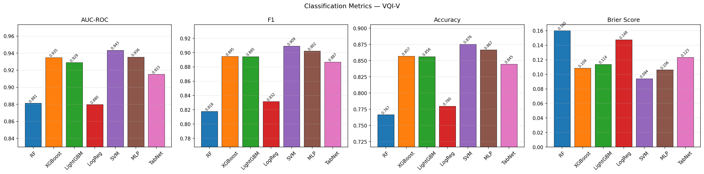

### 5. Calibration
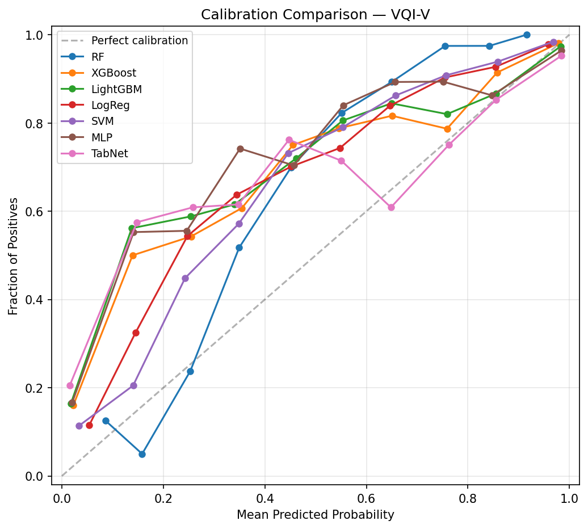

### 6. Confusion Matrices
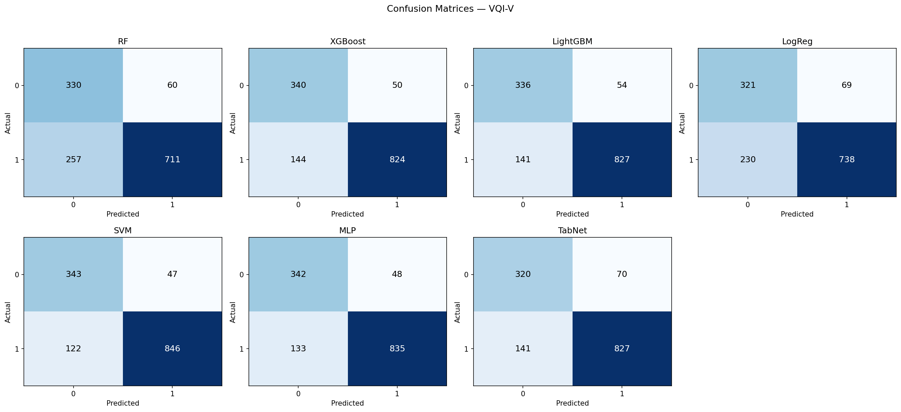

### 7. Inference Speed
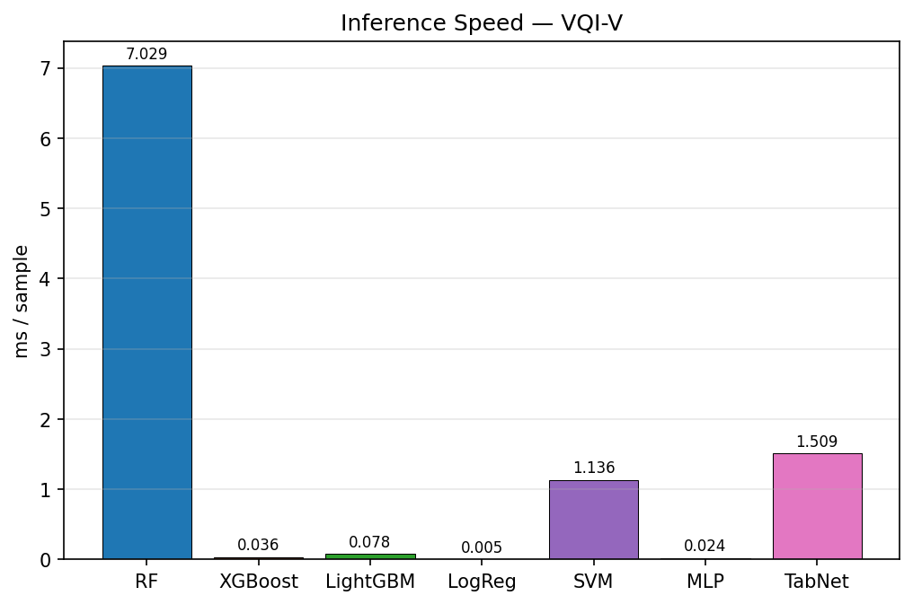

### 8. Feature Importance
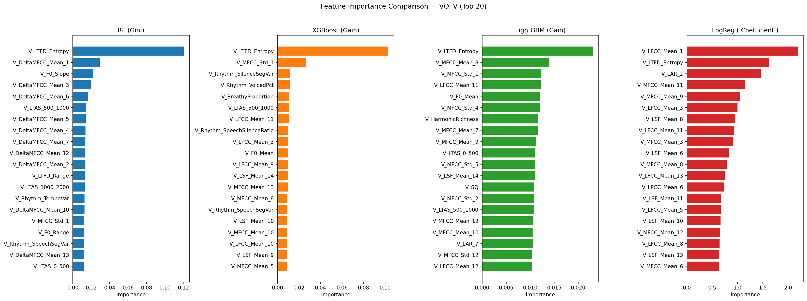

### 9. ERC Curves (sample — VoxCeleb1, P1)
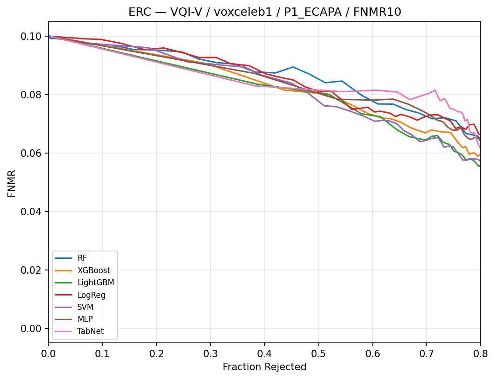

### 10. ERC FNMR Reduction Summary (P1, FNMR@10%, 30% rejection)

| Model | voxceleb1 | vctk | cnceleb | vpqad | vseadc |
|-------|------|------|------|------|------|
| RF | 9.1% | 25.3% | 7.6% | -2.8% | 17.2% |
| XGBoost | 9.4% | 7.1% | 14.5% | -4.7% | 34.9% |
| LightGBM | 16.5% | 0.0% | 0.0% | 1.4% | 20.9% |
| LogReg | 7.4% | 34.6% | 20.9% | -2.9% | -2.4% |
| SVM | 9.9% | -0.5% | -6.0% | -12.9% | 5.0% |
| MLP | 12.8% | 0.0% | 0.0% | 16.7% | 2.3% |
| TabNet | 17.1% | 0.0% | 0.0% | -3.0% | -1.6% |

## Recommendation

### VQI-S

- **Best AUC-ROC:** SVM (0.9371), +6.5 pp over RF (0.8721)
- **Best calibration (Brier):** SVM (0.1015)
- **Fastest:** LogReg (0.005 ms)
- **Most interpretable:** RF (feature importances, decision paths)

**AUC-only recommendation:** SVM (+6.5 pp AUC, speed 2.8 ms) meets both the 2 pp AUC threshold and <50ms speed requirement.

**However — score distribution problem:** SVM (and all non-RF models except LogReg) produce extreme bimodal score distributions clustered at 0 and 100. This makes quality-bin-based evaluation (ERC, DET, CDF shift) ineffective — degenerate bins leave quality groups empty. Only RF spreads scores naturally across [0-100], which is essential for the VQI use case where scores must meaningfully partition samples into quality levels.

**Final recommendation:** **Keep RF as default for VQI-S.** SVM has superior discriminative power but its score distribution is unsuitable for quality-based rejection. Post-hoc calibration (X1.11) may fix score distributions — if so, SVM should be reconsidered.

### VQI-V

- **Best AUC-ROC:** SVM (0.9434), +6.2 pp over RF (0.8814)
- **Best calibration (Brier):** SVM (0.0940)
- **Fastest:** LogReg (0.005 ms)
- **Most interpretable:** RF (feature importances, decision paths)

**AUC-only recommendation:** SVM (+6.2 pp AUC, speed 1.1 ms) meets both the 2 pp AUC threshold and <50ms speed requirement.

**However — same score distribution problem as VQI-S.** SVM clusters scores at 0/100.

**Final recommendation:** **Keep RF as default for VQI-V.** Revisit after post-hoc calibration (X1.11).

## Cross-Score Comparison

| Score | Best AUC Model | AUC-ROC | Recommended Default | Reason |
|-------|---------------|---------|-------------------|--------|
| VQI-S | SVM | 0.9371 | RF (0.8721) | Score distribution essential for quality bins |
| VQI-V | SVM | 0.9434 | RF (0.8814) | Score distribution essential for quality bins |

**Key insight:** AUC-ROC alone is insufficient for model selection in the VQI context. A model that perfectly separates classes but assigns all samples to extreme scores (0 or 100) cannot function as a quality measure. The VQI score must spread across the [0-100] range to enable meaningful quality-based filtering (ERC) and quality-group analysis (DET). RF is currently the only model that achieves this.
